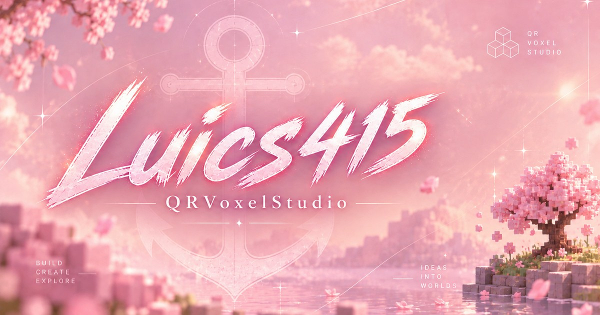

# QR Voxel Studio

Convierte un código QR en un jardín voxel 3D, explóralo por estaciones y compártelo desde una vista cenital precisa.

[](https://luics415.github.io/QRVoxelStudio/)
[](https://nextjs.org/)
[](https://threejs.org/)



## Qué hace

QR Voxel Studio procesa el QR directamente en el navegador y lo transforma en una escena interactiva:

- bosque 3D generado a partir de los módulos activos del QR;
- cuatro estaciones: Primavera, Verano, Otoño e Invierno;
- transición entre el bosque y la matriz QR exacta;
- arrastrar y soltar o seleccionar archivos desde el panel Archivo;
- vista de diagnóstico en `/lab`;
- enlaces compartibles que reconstruyen el jardín sin volver a subir la imagen;
- exportación como PNG, video y GIF desde el navegador;
- interfaz adaptada para móviles y equipos con menos recursos.

## Demo

Abre la aplicación publicada en [luics415.github.io/QRVoxelStudio](https://luics415.github.io/QRVoxelStudio/).

La demo incluye un QR de ejemplo. También puedes cargar un archivo propio en PNG, JPG, JPEG, WebP, SVG o BMP. EPS todavía requiere una conversión previa a SVG o PNG.

## Desarrollo local

Requisitos: Node.js 20 o superior.

```bash
npm install
npm run dev
```

Después, abre [http://localhost:3000](http://localhost:3000).

Comandos disponibles:

```bash
npm run lint
npm run build
npm start
```

En Windows también puedes iniciar el proyecto con `start-dev.bat`.

## Cómo funciona

```text
Archivo -> Normalización -> Decoder -> Reconstrucción -> QRSlot -> Renderer 3D
```

El procesamiento es local. El archivo original no se sube a un servidor. Los enlaces compartidos contienen una representación compacta de la matriz, el contenido decodificado, el nombre y la estación seleccionada.

## Estructura principal

```text
src/
  app/                  Pantallas principal, laboratorio y compartir
  components/qr/        Carga, inspección y matriz del QR
  components/visual/    Escena 3D del bosque voxel
  features/qr-engine/   Decodificación y reconstrucción
  features/export/      PNG, video y GIF
  features/share/       Serialización de enlaces compartidos
  hooks/                Estado del QR activo
  models/               Tipos del modelo QRSlot
```

## Despliegue en GitHub Pages

El repositorio incluye el workflow [`deploy-pages.yml`](.github/workflows/deploy-pages.yml). Para publicarlo:

1. Sube el proyecto a un repositorio llamado `QRVoxelStudio`.
2. En GitHub, abre **Settings > Pages** y selecciona **GitHub Actions** como origen.
3. Haz push a `main` o `master`.

El workflow ejecuta `npm run build`, genera el sitio estático en `out/` y lo publica automáticamente en:

```text
https://luics415.github.io/QRVoxelStudio/
```

El `basePath` se activa solo dentro de GitHub Actions, por lo que el desarrollo local sigue funcionando desde `/`.

## Tecnología

- Next.js 16 con exportación estática;
- React 19 y TypeScript;
- Three.js y React Three Fiber para la escena 3D;
- `jsqr` para decodificar imágenes;
- `gifenc` para crear GIF desde el navegador;
- GitHub Actions y GitHub Pages para el despliegue.

## Almacenamiento y privacidad

La aplicación no utiliza base de datos. La imagen se procesa en el navegador y los enlaces compartidos no contienen el archivo original, sino los datos necesarios para reconstruir el jardín. Por eso no se acumulan QR en GitHub Pages ni existe una tarea de limpieza del servidor.

## Licencia

Este repositorio no declara todavía una licencia de código abierto.
